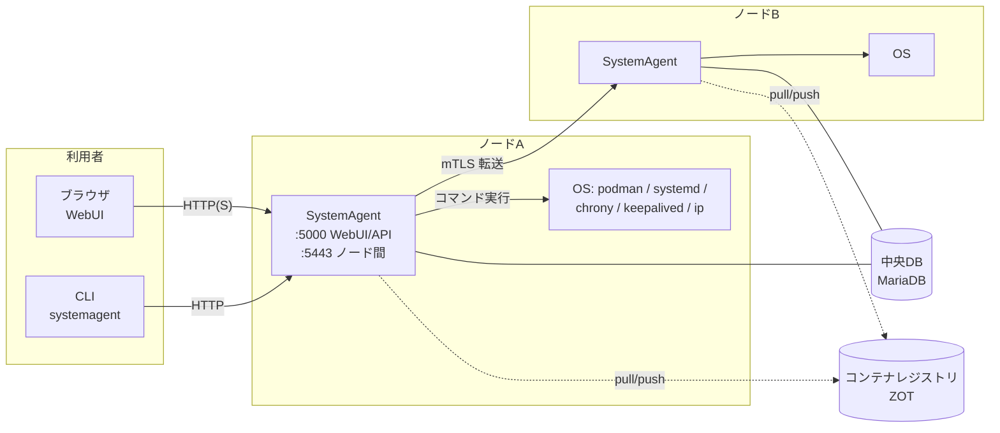
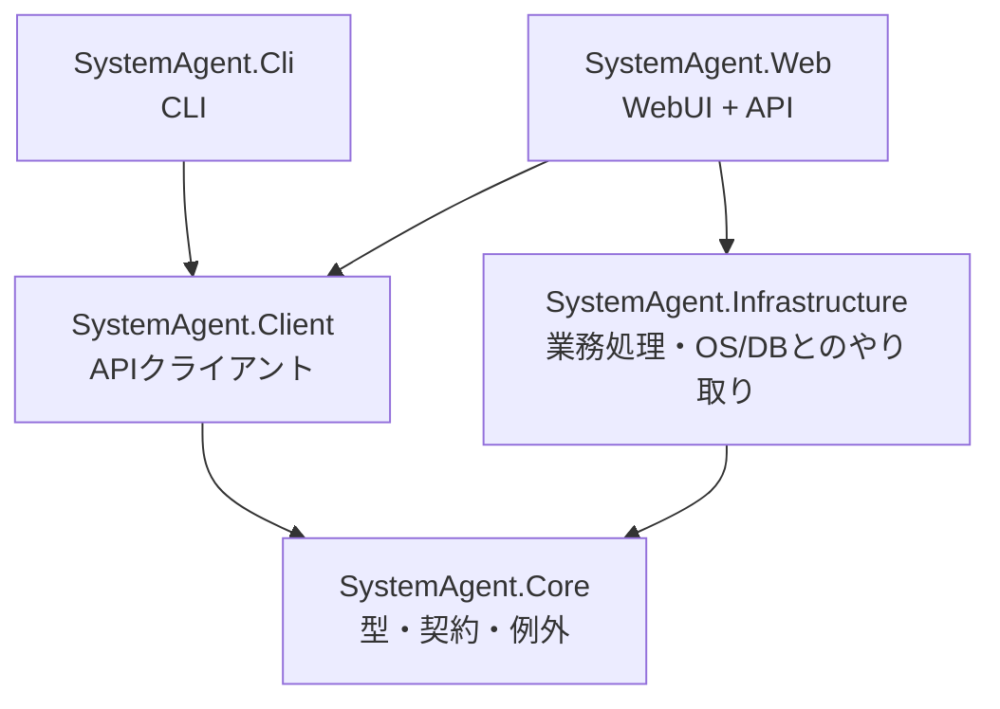
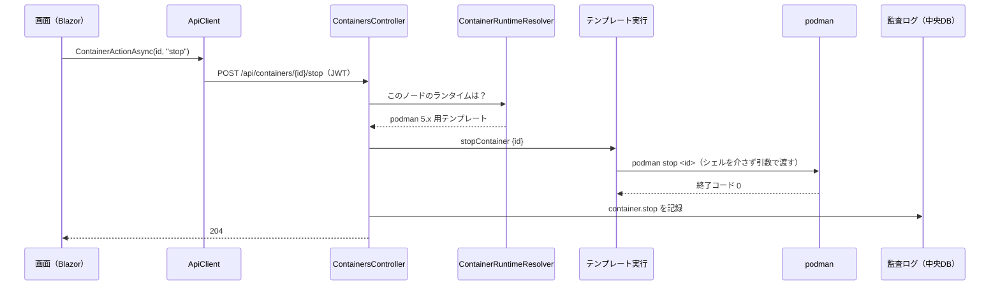
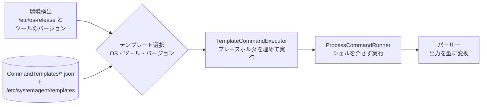
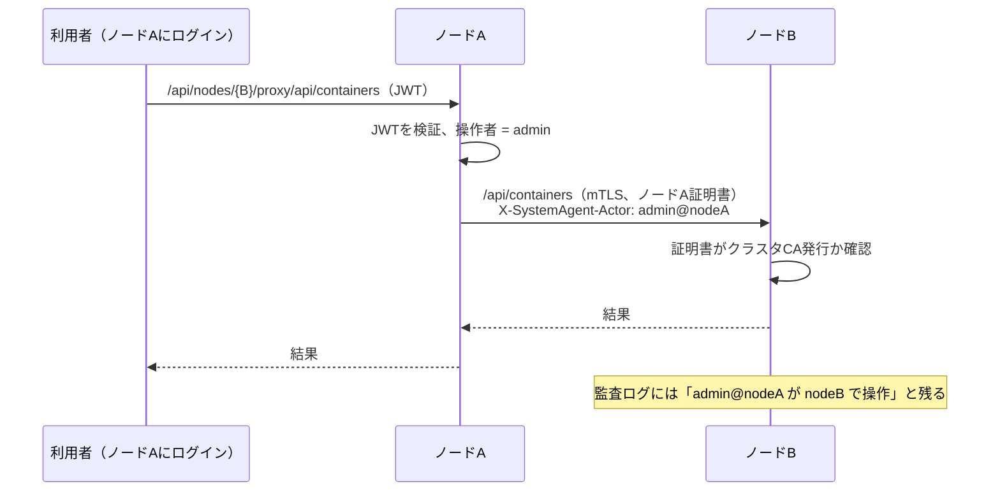
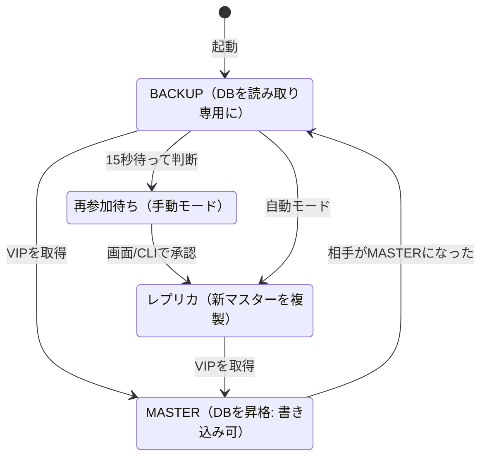
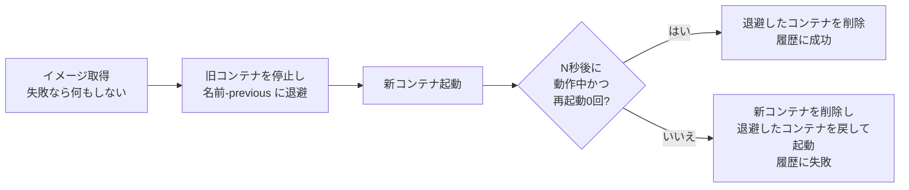

# SystemAgent アーキテクチャ概要

- 対象読者: SystemAgent の開発・保守・運用に新しく関わる人
- 最終更新: 2026-09-28（リファクタリング後の構成）
- 個々の決定の背景は [ADR](../adr/) に、機能の要件は [基本設計書](../design/SystemAgent_基本設計書_draft.md) にある。この資料は「全体がどう組み立てられているか」を1か所で掴むためのもの。

---

## 1. 何をするシステムか

RHEL系・Debian/Ubuntu系のサーバーを、**ブラウザ（WebUI）とコマンド（CLI）の両方から同じ操作で**管理するツール。

- 管理対象: コンテナ（Podman優先 / Docker）・イメージ・レジストリ・アプリのデプロイ、systemd サービス、時刻同期（NTP）、ネットワーク（現在は参照のみ）、Keepalived による冗長化、DBバックアップ、監査ログ
- **複数台（ノード）をまとめて扱える**。どのノードにログインしても、画面上部の「操作対象ノード」（CLIは `--node`）で他のノードを操作できる
- 導入先はお客様の閉じた環境（エアギャップを含む）。RPM/DEB で配布し、各ノードに入れる



---

## 2. 用語

| 用語 | 意味 |
|---|---|
| ノード | SystemAgent を入れたサーバー1台 |
| 中央DB | 全ノードが共有する MariaDB。ユーザー・ノード一覧・監査ログ等を置く |
| ローカル秘密情報 | 各ノードに置く暗号化ファイル（`secrets.enc`）。ホスト固有の鍵（`master.key`）で暗号化する |
| 緊急認証 | ローカル秘密情報にある管理者で入るログイン。DB停止中でも使える |
| Capability | OSの機能のまとまり（container-runtime、ntp、service-manager など） |
| コマンドテンプレート | OS・ツール・バージョンごとの実際のコマンドを書いた JSON |
| 転送（プロキシ） | 他ノードの操作を、ログイン中のノード経由で相手に送る仕組み |

---

## 3. 配置（1ノードの中身）

各ノードでは **SystemAgent の1プロセス**が動き、WebUI・API・ノード間通信をまとめて受け持つ（ADR-007）。systemd のユニットは運用側で用意し、root で起動する（ADR-017）。

| 項目 | 内容 |
|---|---|
| 待ち受け | `:5000` WebUI と API（HTTP。TLS終端は必要なら Nginx、ADR-004）／ `:5443` ノード間通信（mTLS、ADR-018） |
| プログラム | `/usr/lib/systemagent/`（Web）、`/usr/bin/systemagent`（CLI） |
| 設定 | `/etc/systemagent/systemagent.json`（ポート・ノード名・バックアップ等。秘密情報は置かない） |
| ローカル秘密情報 | `/var/lib/systemagent/secrets/`（`master.key` と `secrets.enc`、root のみ） |
| その他のデータ | `/var/lib/systemagent/backups/`（DBバックアップ）、`ha-state.json`・`ha-hook-token`（冗長化） |
| コマンドテンプレートの追加・上書き | `/etc/systemagent/templates/`（再ビルドなしで新しいOSに対応） |

中央DB は別サーバー（または Keepalived で冗長化した2台、ADR-022）。

---

## 4. ソフトウェアの構成

### 4.1 プロジェクトと依存関係



| プロジェクト | 役割 | 置いてはいけないもの |
|---|---|---|
| **Core** | 画面・CLI・サーバーで共有する型（APIの要求/応答、インターフェース、例外）。外部ライブラリに依存しない | 処理の実装 |
| **Infrastructure** | 業務処理の本体。OSコマンドの実行、DB、ローカル秘密情報、クラスタ、HA、デプロイ等 | HTTP・画面の事情 |
| **Client** | API を呼ぶクラス `ApiClient`。WebUI と CLI の両方がこれだけを使う | 業務ロジック |
| **Web** | API（コントローラー）と WebUI（Blazor Server）。受け付け・認証・表示・転送だけを行う | 業務ロジック（Infrastructure に置く） |
| **Cli** | コマンドの定義と表示。`ApiClient` を呼ぶだけ | 業務ロジック |

**WebUI と CLI の操作が同じになる理由**: どちらも自分で処理をせず、同じ API を `ApiClient` 経由で呼ぶから（WebUI も自ノードの API を HTTP で呼んでいる）。機能を足すときは API を先に作り、画面と CLI はそれを呼ぶだけにする。

### 4.2 1つの操作が流れる道筋

例: 画面で「コンテナを停止」を押したとき。



他ノードを選んでいる場合は、`ApiClient` が送り先を `/api/nodes/{id}/proxy/api/...` に変え、ログイン中のノードが相手ノードへ転送する（6.4）。

### 4.3 フォルダの見取り図

```
src/
  SystemAgent.Core/            型と契約
    Contracts/ApiContracts.cs    APIの要求・応答
    CapabilityProviders/         OS機能のインターフェースとデータ型
    Errors/                      業務上の例外（ErrorKind）
    Deploy/ Ha/ Nodes/ Users/ …  機能ごとの型
  SystemAgent.Infrastructure/  業務処理
    CapabilityProviders/         OS機能の実装（コンテナ・NTP・ネットワーク・サービス）とテンプレートの仕組み
    CommandTemplates/            コマンドテンプレート（JSON）
    Commands/                    OSコマンドの実行（ProcessCommandRunner）
    Cluster/                     自己CA・参加・mTLS
    Ha/                          Keepalived と DB の昇格・降格
    Deploy/                      アプリのデプロイ
    Backup/                      DBバックアップ
    Persistence/                 中央DB（EF Core、マイグレーション）
    Security/                    ローカル秘密情報
    Auditing/                    監査ログの記録・検索
  SystemAgent.Client/          ApiClient（機能ごとに ApiClient.*.cs）
  SystemAgent.Web/
    Controllers/                 API
    Components/Pages/            画面（1画面1ファイル）
    Components/Shared/           画面部品（ConfirmButton、ImageDropZone、OperationNotices …）
    Api/                         例外→HTTP応答、ノード転送、アップロード用チケット
    Auth/                        JWT、ノード証明書認証
    Resources/                   画面の文言（日本語）
  SystemAgent.Cli/
    Commands/                    コマンド群ごとの定義（ContainerCommands.cs など）
    CliContext.cs                接続先の決定・ノード転送・エラー表示
tests/SystemAgent.Core.Tests/  単体テスト（xUnit）
build/package/                 RPM/DEB（nfpm）
scripts/dev/                   WSL検証環境の操作
docs/                          設計書・ADR・QA・この資料
```

---

## 5. OSの違いを吸収する仕組み（Capability Provider とコマンドテンプレート）

OSやツールのバージョンによってコマンドや出力形式が違う。この違いを**コードではなく JSON のテンプレート**に閉じ込め、新しいOS対応は原則テンプレートの追加だけで済むようにしている（ADR-005、ADR-016）。



- テンプレートの例（`container-runtime/podman.json`）: `"stopContainer": { "args": ["stop", "{id}"] }`
- `{name}` は1つの値、`{*name}` は値の数だけ引数を繰り返す（ポート・環境変数など）
- 値は必ず検証してから渡す（先頭の `-` を拒否する等）。シェルを介さないため、値によるコマンドインジェクションは起きない
- 必須コマンド・使えるプレースホルダ・パーサーは `TemplateRequirements.cs` で検証する（不正なテンプレートは読み込まない）
- 現在のテンプレート: podman / docker、chrony（RHEL/Debian）/ timesyncd、iproute2、systemctl、keepalived、mariadb-dump / mysqldump

---

## 6. 主要な仕組み

### 6.1 認証と権限

| 方式 | 使う場面 | 仕組み |
|---|---|---|
| 通常認証 | 普段の運用 | 中央DBのユーザー。パスワードはハッシュで保存 |
| 緊急認証 | DB停止中・初期構築 | ローカル秘密情報の管理者。いつでも使える（使ったことは記録される） |
| ノード証明書 | ノード間の転送 | クラスタCAが発行した証明書（mTLS）。操作者名はヘッダで受け取る |

- ログインすると **JWT（有効8時間、更新なし）** を発行する。署名鍵はローカル秘密情報にある
- 役割（ロール）による権限の区別はない。ログインできる人は全機能を使える（ADR-015）
- 初期セットアップは、サーバー上にだけ置かれるワンタイムの `setup-token` を知っている人しかできない

### 6.2 データをどこに置くか

**「中央DBが止まっても、各ノードの管理（特に復旧作業）はできる」** ことを重視して置き場所を分けている。

| 置き場所 | 中身 | 理由 |
|---|---|---|
| 中央DB | 通常ユーザー、ノード一覧、監査ログ、クラスタ設定、参加トークン | 全ノードで共有する情報 |
| ローカル秘密情報（ノードごと、暗号化） | JWT署名鍵、緊急管理者、DB接続文字列、CA鍵・ノード証明書、HA設定、レジストリの認証情報、デプロイ定義 | 秘密情報を含む／DB停止中も必要 |
| ファイル | バックアップ、HAの状態、設定ファイル | — |

ローカル秘密情報に JSON で値を保存するときは `SecretJsonStore<T>` を使う（読み込み・保存・排他をまとめたもの）。

### 6.3 エラーの扱い

業務上の失敗は `SystemAgentException` を継承した例外で表し、**種類（ErrorKind）から HTTP ステータスが決まる**。メッセージは利用者向けの日本語で、そのまま画面・CLIに出る。

| 種類 | HTTP | 例 |
|---|---|---|
| InvalidInput | 400 | 入力の形式が不正（`ArgumentException` も 400） |
| NotFound | 404 | 定義されていないアプリ、レジストリにないタグ |
| Conflict | 409 | マスター中に再参加しようとした、デプロイ中 |
| OperationFailed | 422 | OSコマンドの失敗、デプロイ失敗（元に戻した） |
| NotSupported | 501 | この環境にツールが無い |
| Unreachable | 502 | 他ノード・レジストリに接続できない |
| （DB接続障害） | 503 | 画面・CLIは緊急ログインを案内する |

画面側は `PageOperation`（実行中・エラー・完了メッセージ）と `OperationNotices`（表示）、CLI側は `CliContext.Run`（「エラー: …」と終了コード1）で共通に扱う。

### 6.4 複数ノード（クラスタ）



- 最初の1台で「クラスタ初期化」すると自己CAができる。以降のノードは**参加トークン**（CA証明書の指紋入り、ワンタイム）で参加する
- ノード間の認証は DB に依存しない（証明書はローカル秘密情報にある）
- 転送は汎用の仕組みなので、新しい機能も追加の実装なしに他ノードで使える

### 6.5 冗長化（Keepalived + DB の昇格・降格）

VIP を持つノードの DB がマスター。keepalived の状態変化を SystemAgent が受け取り、DB を切り替える（ADR-022）。



- 元マスターの自動復帰はしない（`nopreempt`）。再参加は既定で人が承認する
- 再参加前に、接続先が本当にマスターか・DBの前提設定（GTID等）が揃っているかを確認する

### 6.6 コンテナ・イメージ・デプロイ

| 機能 | 仕組み |
|---|---|
| イメージの取り込み（D&D） | 画面がサーバー側で**使い捨てのアップロード用チケット**（10分・1回）を発行し、ブラウザがそのURLへファイルを直接送る（SignalRを通さないので数GBでも速い）。他ノード宛てはそのまま mTLS で転送。受け取ったら `podman load` |
| レジストリ | 認証情報をローカル秘密情報に保存し、pull / push の直前に毎回ログイン（Podmanのログイン状態は再起動で消えるため）。ZOT等の中身は OCI Distribution API で一覧・タグ削除 |
| Push | 送り先の名前を一時的に付けて送り、元から無かった名前なら外す（`ImageTransferService`） |
| デプロイ | 「取得 → 旧コンテナを退避 → 新コンテナ起動 → 一定時間後に動作・再起動回数を確認」。失敗したら自動で元のコンテナに戻す（ADR-024） |



### 6.7 監査ログ

- すべての変更操作を中央DBに記録する（誰が・いつ・どのノードで・何を）。他ノード経由なら実行者は `ユーザー@転送元ノード`
- DB停止中の操作はDBに残らず、各ノードのアプリログにだけ残る（ADR-009）
- 画面・CLIで検索とCSV出力ができ、CSV出力したこと自体も記録する（ADR-025）

---

## 7. 障害のときどうなるか

| 障害 | 影響 | 使えるもの |
|---|---|---|
| 中央DB停止 | 通常ログイン・ユーザー管理・ノード一覧・監査ログの記録と閲覧ができない | 緊急ログインで、コンテナ・サービス・NTP・HA・デプロイ・ロールバックなどノードの操作はできる |
| ノード1台停止 | そのノードは操作できない（転送は 502） | 他のノードは影響なし |
| CAを持つノードの停止 | 新しいノードを参加させられない | 既存ノード間の通信・転送は影響なし |
| DBマスターのノード停止 | Keepalived が VIP を移し、移った先の DB が昇格する | 復旧したノードは承認後にレプリカとして再参加 |
| デプロイした新バージョンが起動しない | 自動で元のコンテナに戻る | 履歴と画面に失敗理由が出る |

---

## 8. 開発と検証

| やりたいこと | 方法 |
|---|---|
| ビルド・テスト | `dotnet build` / `dotnet test`（VS Code ではタスク `build` / `test`） |
| 画面の確認（Windows上） | VS Code の「Web（Windows・画面/DB確認用）」。Linux専用機能は 501 になる |
| 全機能の確認 | WSL の検証用3ノード（AlmaLinux 9 / Ubuntu 24.04 / Debian）。タスク「WSL: 3ノードを起動（Debugビルド）」→ http://localhost:5000 |
| WSLのノードをデバッグ | 「WSL: 実行中の node-a にアタッチ」（README「VS Codeでのビルド・デバッグ」） |
| DBの変更 | `dotnet ef migrations add <名前> --project src/SystemAgent.Infrastructure --startup-project src/SystemAgent.Web -o Persistence/Migrations`。本番は `systemagent db migrate` |
| パッケージ | `./build/package/package.ps1 -Version x.y.z`（nfpm） |

単体テストは OSコマンドを実際には実行しない（`FakeRunner` がコマンドを記録し、決めた出力を返す）。OSとの結合は WSL 上で確認する。

---

## 9. 拡張するとき

| やりたいこと | 手順 |
|---|---|
| 新しいOS・バージョンに対応 | コマンドテンプレートを追加する（コード変更は原則不要）。出力形式が違う場合はパーサーを追加 |
| 新しい機能 | ① Core に要求/応答の型 → ② Infrastructure に処理 → ③ Web にコントローラー（監査ログを残す）→ ④ `ApiClient` にメソッド → ⑤ 画面（`PageOperation` を使う）と CLI（`Commands/` に追加）→ ⑥ ADR |
| 新しい失敗の種類 | `SystemAgentException` を継承して `Kind` を決める（例外ハンドラーの修正は不要） |
| 秘密情報を含む設定を保存 | `SecretJsonStore<T>` を使う |
| 画面の文言 | `Resources/SharedResource.resx` に追加（コードに直接書かない） |

---

## 10. 既知の制約・今後の予定

- ネットワーク設定の**変更**は未実装（QA-0005 の回答どおり、NetworkManager から、確認付き自動ロールバック方式で実装予定）
- デプロイの拡張（QA-0006）: Pod 単位のデプロイ・起動順序・プリセット、複数ノードへの一括デプロイ、HTTPヘルスチェック、無停止の切り替え
- 証明書の更新（期限前の再発行）・失効は未実装（ADR-012）
- JWT は発行後の即時失効ができない（署名鍵の更新で全体を失効させる）
- 監査ログの保持期間・自動削除、外部への転送はない

---

## 11. 決定記録（ADR）

| 分野 | ADR |
|---|---|
| 全体方針 | [001 フロントエンド](../adr/0001-frontend-technology.md)、[005 コマンド抽象化](../adr/0005-command-abstraction.md)、[007 WebUIとAPIを1プロセスに](../adr/0007-webui-api-single-process.md)、[013 実装順序](../adr/0013-mvp-implementation-order.md) |
| セキュリティ | [003 秘密情報の保護](../adr/0003-secret-protection.md)、[004 TLS終端](../adr/0004-tls-termination.md)、[015 認証と初期セットアップ](../adr/0015-auth-policy-and-initial-setup.md)、[017 実行ユーザー](../adr/0017-execution-user.md) |
| クラスタ・冗長化 | [002 ノード間の永続化](../adr/0002-node-persistence.md)、[018 自己CAと転送](../adr/0018-cluster-pki-and-node-proxy.md)、[022 Keepalived と DB昇格](../adr/0022-keepalived-and-db-promotion.md) |
| 機能 | [016 テンプレート](../adr/0016-command-template-implementation.md)、[020 バックアップ](../adr/0020-db-backup.md)、[021 サービス管理](../adr/0021-service-management.md)、[023 レジストリ](../adr/0023-container-registry-credentials.md)、[024 デプロイ](../adr/0024-app-deployment.md)、[025 監査ログの閲覧](../adr/0025-audit-log-viewer.md)、[026 Pushとレジストリ管理](../adr/0026-image-push-and-registry-browser.md) |
| 配布・環境 | [006 パッケージング](../adr/0006-packaging.md)、[019 パッケージ構成](../adr/0019-packaging-layout-and-db-connection.md)、[014 開発・検証環境](../adr/0014-dev-test-environment.md) |
