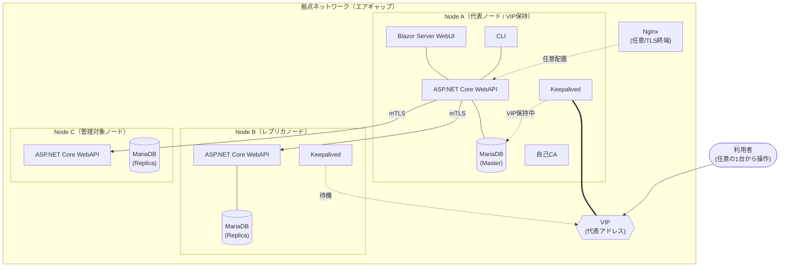
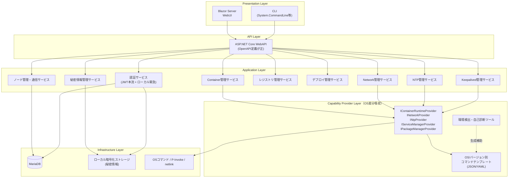
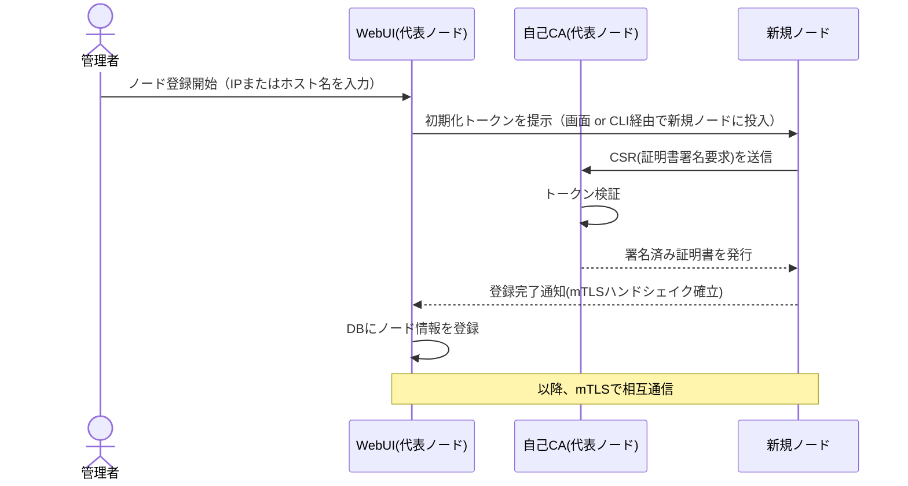
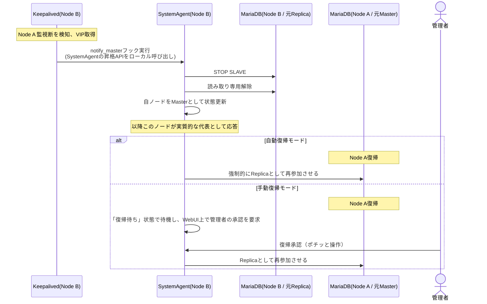
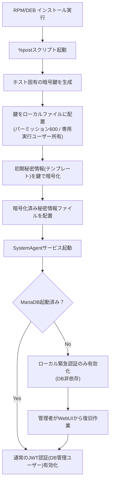
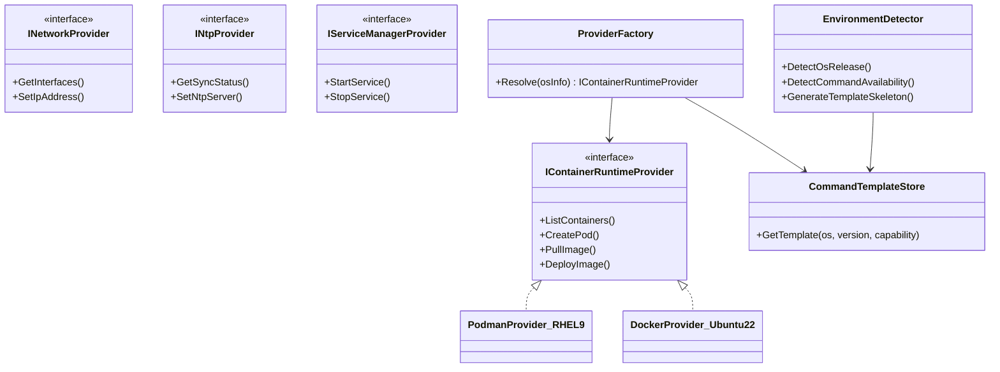
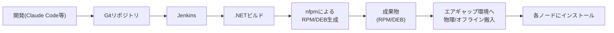

# SystemAgent 基本設計書（ドラフト v0.1）

> 本書は要件ヒアリングに基づく設計ドラフトです。未決事項は「TBD」として明記しています。実装フェーズではAIエージェント(Claude Code等)への指示の土台として利用することを想定しています。

---

## 1. 概要

### 1.1 目的
コンテナ(Podman/Docker)、ホストネットワーク、NTP、Keepalived、コンテナレジストリ等、RHEL系（およびDebian/Ubuntu系）サーバーの運用管理を統合的に行うツール。自ノードだけでなく、登録済みの他ノードに対しても同一のUI/CLIから操作可能とする。自社の各種ソフトウェア（コンテナベース）のイメージ更新・デプロイ機能を含む。

### 1.2 背景
社内PoCツールが製品化される見込みとなったため、私的に開発する後継/代替のベースアプリケーションとして位置づける。

### 1.3 スコープ
- 対象: RHEL系、Debian/Ubuntu系（複数バージョン、EOL版含む）
- 対象外: macOS、Windows、Docker Compose対応、大規模一般公開利用

---

## 2. 要件サマリ（確定事項）

### 2.1 機能要件
| 項目 | 内容 |
|---|---|
| コンテナ管理 | Podman/Docker対応。Podmanの場合はPod(ネットワークグループ)を利用 |
| イメージ管理 | エアギャップ環境向けにWebUIからイメージをインポート可能 |
| ネットワーク設定 | ホストネットワーク変更 |
| NTP設定 | 時刻同期設定 |
| Keepalived設定・管理 | VIP管理、昇格スクリプト管理を含む |
| コンテナレジストリ管理 | プライベートレジストリの管理 |
| マルチノード操作 | 任意の1台から他ノードを操作可能 |
| デプロイ機能 | 自社ソフトウェア(コンテナ)のイメージ更新・デプロイ |
| 提供形態 | WebUI(全操作可能) + CLI(WebUIと同一操作が可能) |
| 配布形態 | RPM/DEB (nfpmで生成) |

### 2.2 非機能要件
| 項目 | 内容 |
|---|---|
| 可用性 | 24365想定。中央DB構成だがKeepalived+VIPで冗長化可能な設計とする |
| セキュリティ | 既存JWT基盤を踏襲しつつ、DB非依存のローカル緊急認証を別建て |
| スケーラビリティ | 想定不要（同時利用2〜3人） |
| 保守性 | チーム開発。将来の機能追加をAIエージェントが行うことを前提とした拡張性を確保 |
| 永続化 | 管理情報はMariaDB中心。ノードローカル保持も許可。バックアップ機能必須 |
| ネットワーク帯域 | バックアップ時の帯域制御が必要（業務影響回避） |
| オフライン対応 | エアギャップ環境が前提（必須） |
| 多言語対応 | 現状不要だが将来対応できる構造が望ましい |

### 2.3 技術要件（確定）
| 項目 | 内容 |
|---|---|
| OS | RHEL系、Debian/Ubuntu系（複数世代・EOL版含む） |
| バックエンド | C# .NET 10 / ASP.NET Core (Kestrel) |
| フロントエンド | Blazor Server（Vue3・Angularは不採用。ビルドパイプライン分離コスト回避のため） |
| DB | MariaDB（中央DB方式、任意でレプリカ冗長化） |
| 冗長化 | Keepalived + VIP（Galera等のクラスタ構成は不採用。運用スキル要件が高いため） |
| TLS終端 | Nginx（任意コンポーネント。無くてもHTTPで動作可、その場合は自己責任） |
| CI/CD | Jenkins |
| パッケージング | nfpm（Go製、RPM/DEB両対応） |
| 認証 | JWTベース（既存基盤 + DB非依存のローカル緊急認証を別建て） |

---

## 3. 全体アーキテクチャ

### 3.1 マルチノード構成図

**ポイント**
- 利用者はVIP経由でどのノードが代表(Master)でも同じ入口からアクセスする。
- 各ノードのSystemAgentは自身のAPIを持ち、他ノードへはmTLSで通信する（分散エージェント方式）。
- MariaDBは中央DB方式。冗長化を希望するノードはレプリカを構築し、Keepalived+VIPで切替。

### 3.2 レイヤー構成図

**設計原則**
- WebUI・CLIは**同一のWebAPIを叩くクライアント**であり、業務ロジックを持たない。機能同一性はこの構造で自動的に担保される。
- OS差分は Capability Provider 層に隔離し、上位のApplication Layerからは意識させない。

---

## 4. マルチノード通信・ノード登録

### 4.1 ノード登録シーケンス

- CA管理機能（発行・失効・更新）をWebUIの正式機能として実装する。
- ノード一覧は中央DBで一元管理し、全ノードから同一のノードリストが参照される。

### 4.2 Keepalived + フェイルオーバー（昇格）シーケンス

既存のBashによる昇格スクリプトの仕組みを、SystemAgent自身に組み込む方針。Keepalivedの`notify_master`フックがSystemAgentの昇格APIを呼び出す形にすることで、秘密情報(DB接続情報等)をBashスクリプト内に書かずに済み、権限もSystemAgentの実行ユーザーに閉じ込められる。

- **自動復帰モード**／**手動復帰モード**を運用ポリシーとして選択可能にする（人間の操作は承認ボタン一つに集約）。
- Split Brain対策として、旧MasterがVIPを失った時点で自動的に読み取り専用へ強制する処理も併せて組み込む。

---

## 5. 秘密情報の保護

### 5.1 方針
- Git上ではテンプレート（RAW）状態のまま管理し、鍵は含めない。
- RPMインストール時（`%post`スクリプト）に、その場でホスト固有の鍵を生成し、初期秘密情報を暗号化して配置する。
- バイナリへの秘密鍵埋め込みは行わない。

### 5.2 インストール〜初回起動フロー

### 5.3 TBD（要検討）
- TPM2搭載環境での鍵シール化の可否（ハードウェア依存のためフォールバック設計が必要）
- Linuxカーネルキーリング(`keyctl`)による実行時メモリ保持の要否

---

## 6. 認証・認可設計

| 認証経路 | 用途 | 保存先 |
|---|---|---|
| 通常JWT認証 | 既存システムと同一基盤。DB管理ユーザーによるログイン | MariaDB |
| ローカル緊急認証 | MariaDB起動前・停止中のログイン専用。DBとは独立したJWT発行基盤 | 暗号化ローカルファイル（5章と同一基盤） |

- 外部IdP等は使用しない。
- 秘密情報(appsettings、DB接続情報)の変更機能は、上記いずれの認証でも操作可能とし、操作ログを残す（監査要件は今後の検討事項）。

---

## 7. コマンド抽象化（Capability Provider パターン）

### 7.1 構成イメージ

### 7.2 方針
- ドメイン単位のインターフェース(C#)は固定。実装差分はOS/バージョンごとのテンプレート(JSON/YAML)として外部化し、人間（または将来的にAIエージェント）が埋める運用とする。
- 可能な範囲は.NETネイティブ/P-Invoke/netlink等で直接処理し、OSコマンド実行を避ける。
- 構造化出力(`--json`等)に対応するコマンドを優先し、非構造化出力のパースはテンプレート単位に隔離する。
- 環境検出・自己診断ツールをSystemAgentの初期機能として実装し、テンプレート雛形の生成を補助する。

---

## 8. デプロイ・CI/CD

---

## 9. 拡張性・AIエージェント協働のための設計ルール

将来的にClaude Code等のAIエージェントが機能追加を行うことを前提に、以下をルール化する。

1. **拡張ポイントの明示**：新しい管理対象（ファイアウォール、ログローテーション等）は、Capability Providerのインターフェース実装追加のみで対応できる構造を維持する。
2. **ADR(Architecture Decision Record)方式の採用**：本書の意思決定は`docs/adr/`配下に決定記録として残し、後続の機能追加時に背景を参照可能にする（10章に初期ADR一覧を記載）。
3. **OpenAPI定義を機能一覧の正とする**：WebUI/CLIが叩くASP.NET Core WebAPIのOpenAPI定義を正とし、機能追加時は「API定義拡張 → 実装」の順序をルールとする。
4. **コマンドテンプレートのスキーマ化**：7章のテンプレートスキーマを固定し、新規OS/バージョン対応をテンプレート追加のみで完結しやすくする。

---

## 10. ADR一覧（初期）

| ID | タイトル | 決定内容 | 理由 |
|---|---|---|---|
| ADR-001 | フロントエンド技術選定 | Blazor Server採用、Vue3/Angular不採用 | ASP.NETとの親和性、単一ビルドパイプラインでのRPM配布のしやすさ |
| ADR-002 | ノード間永続化方式 | 中央DB方式（Galera等のクラスタ方式は不採用） | 利用者のDB運用スキル・DNS運用制約を考慮し、Keepalived+VIPによる古典的冗長化を選定 |
| ADR-003 | 秘密情報の保護方式 | インストール時にホスト固有鍵を生成しローカル暗号化。バイナリへの鍵埋め込みは行わない | エアギャップ環境でクラウドKMS等が使用できないため |
| ADR-004 | TLS終端の扱い | Nginxは任意コンポーネント。無い場合のHTTP平文アクセスを許可 | エアギャップ・小規模運用における導入コストを優先。リスクは利用者が許容 |
| ADR-005 | コマンド抽象化方式 | Capability Providerパターン + データ駆動(テンプレート外部化) | 多OS・多バージョン・EOL対応をコード変更なしで拡張可能にするため |
| ADR-006 | パッケージング方式 | nfpm(Go製)を用いてRPM/DEB両対応 | 単一ツールで両形式に対応できるため |

---

## 11. 未決事項（TBD）一覧

| # | 項目 | 内容 |
|---|---|---|
| 1 | TPM2活用可否 | 秘密鍵のハードウェアシール化。対応環境と非対応環境のフォールバック設計 |
| 2 | 監査ログ要件 | 秘密情報変更操作等の監査ログ保存・閲覧機能の要否 |
| 3 | バックアップの帯域制御方式 | 具体的な制御方式（QoS/アプリ側スロットリング等）の選定 |
| 4 | 多言語対応の実装範囲 | Blazor Serverでのリソースファイル設計方針 |
| 5 | 証明書失効時の運用 | CA失効リストの配布・反映タイミング（エアギャップのため即時反映不可） |

---

## 12. 次のアクション

- [ ] 上記TBD項目の方針決定
- [ ] APIエンドポイント一覧（OpenAPI草案）の作成
- [ ] コマンドテンプレートのスキーマ定義
- [ ] DBスキーマ設計（ノード管理・秘密情報メタデータ・ユーザー管理）
